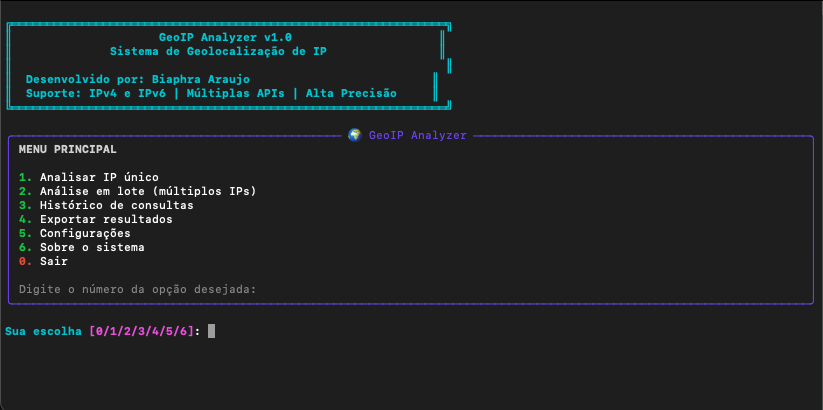

# GeoIP Analyzer v1.0

Sistema completo de geolocalização de endereços IP para analistas de segurança cibernética.



## 🚀 Características

- **Suporte IPv4 e IPv6**: Análise completa de ambos os protocolos
- **Múltiplas APIs**: HackerTarget, IP-API, IPInfo para maior precisão
- **Interface Interativa**: Menu intuitivo com Rich UI
- **Análise em Lote**: Processamento de múltiplos IPs
- **Consolidação Inteligente**: Combina resultados de várias fontes
- **Exportação JSON**: Salva resultados para análise posterior
- **Histórico Completo**: Rastreia todas as consultas realizadas

## 📋 Pré-requisitos

- Python 3.7+
- Conexão com internet
- Dependências listadas em `requirements.txt`

## 🔧 Instalação

1. Clone ou baixe os arquivos para o diretório
2. Instale as dependências:
```bash
pip install -r requirements.txt
```

## 🎯 Uso

### Execução Principal
```bash
python main.py
```

### Exemplo de Uso Programático
```python
from geoip_analyzer import GeoIPAnalyzer

analyzer = GeoIPAnalyzer()

# Análise de IP único
result = analyzer.analyze_ip("8.8.8.8")
print(result)

# Análise em lote
ips = ["8.8.8.8", "1.1.1.1", "9.9.9.9"]
results = analyzer.analyze_batch(ips)
```

## 🌍 APIs Utilizadas

1. **HackerTarget** (Principal)
   - URL: `https://api.hackertarget.com/geoip/?q={ip}`
   - Formato: Texto estruturado
   - Rate Limit: Moderado

2. **IP-API** (Secundária)
   - URL: `http://ip-api.com/json/{ip}`
   - Formato: JSON
   - Rate Limit: 45 req/min

3. **IPInfo** (Terciária)
   - URL: `https://ipinfo.io/{ip}/json`
   - Formato: JSON
   - Rate Limit: 50k req/mês

## 📊 Funcionalidades do Menu

### 1. Análise de IP Único
- Validação automática de IPv4/IPv6
- Opção de usar múltiplas fontes
- Exibição detalhada dos resultados
- Links para Google Maps
- Dados de confiança

### 2. Análise em Lote
- Entrada manual ou por arquivo
- Processamento sequencial com rate limiting
- Resumo estatístico
- Exportação automática

### 3. Histórico de Consultas
- Visualização das últimas consultas
- Detalhes de consultas específicas
- Exportação do histórico
- Limpeza do histórico

### 4. Exportação de Resultados
- Formato JSON estruturado
- Timestamp automático
- Metadados incluídos

## 🔍 Campos Retornados

- **País**: Nome completo e código
- **Região/Estado**: Divisão administrativa
- **Cidade**: Localização específica
- **Coordenadas**: Latitude e longitude
- **ISP**: Provedor de internet
- **Organização**: Entidade responsável
- **Timezone**: Fuso horário
- **Confiança**: Nível de precisão dos dados

## 📁 Estrutura de Arquivos

```
GeoIP/
├── main.py                 # Interface principal
├── geoip_analyzer.py       # Classe principal
├── requirements.txt        # Dependências
├── example_ips.txt        # IPs de exemplo
├── README.md              # Documentação
└── exports/               # Resultados exportados
```

## 🛡️ Segurança e Limitações

### Validações Implementadas
- Verificação de formato IPv4/IPv6
- Detecção de IPs privados
- Timeout de 10 segundos por consulta
- Rate limiting entre requisições

### Limitações
- IPs privados não podem ser geolocalizados
- Precisão varia conforme a fonte
- APIs gratuitas têm limites de uso
- Alguns IPv6 podem ter suporte limitado

## 🎨 Interface

O sistema utiliza a biblioteca Rich para uma interface moderna:
- Cores e formatação avançada
- Tabelas estruturadas
- Barras de progresso
- Painéis informativos
- Prompts interativos

## 📈 Casos de Uso

### Análise Forense
- Investigação de logs de acesso
- Rastreamento de atividades suspeitas
- Correlação geográfica de eventos

### Monitoramento de Segurança
- Análise de tentativas de intrusão
- Verificação de origem de tráfego
- Detecção de anomalias geográficas

### Auditoria de Infraestrutura
- Mapeamento de ativos de rede
- Verificação de configurações
- Documentação de topologia

## 🔧 Configuração Avançada

### Timeout Personalizado
```python
analyzer = GeoIPAnalyzer()
analyzer.session.timeout = 15  # 15 segundos
```

### Headers Customizados
```python
analyzer.session.headers.update({
    'User-Agent': 'Meu-Analyzer/1.0'
})
```

## 📝 Exemplos de Saída

### IP Único
```json
{
  "success": true,
  "ip": "8.8.8.8",
  "country": "United States",
  "city": "Mountain View",
  "latitude": "37.4056",
  "longitude": "-122.0775",
  "isp": "Google LLC",
  "confidence": "Alta (3 fontes concordam)"
}
```

### Lote
```json
{
  "timestamp": "2024-01-15T10:30:00",
  "total_analyzed": 3,
  "results": [...]
}
```

## 🐛 Troubleshooting

### Erro de Conexão
- Verifique a conexão com internet
- Teste com `ping google.com`
- Verifique firewall/proxy

### API Indisponível
- Sistema usa múltiplas APIs automaticamente
- Falha em uma API não impede o funcionamento
- Rate limiting é aplicado automaticamente

### IP Inválido
- Verifique formato IPv4: `192.168.1.1`
- Verifique formato IPv6: `2001:db8::1`
- IPs privados retornam erro específico

## 👨‍💻 Desenvolvedor

**Biaphra Araujo**
- Especialista em Segurança Cibernética
- Análise de Infraestrutura e Threat Intelligence
- Desenvolvimento de Ferramentas de Segurança

## 📄 Licença

Sistema desenvolvido para uso em análise de segurança cibernética.
Respeite os termos de uso das APIs utilizadas.

---

**Versão**: v1.0  
**Data**: 22 de ago 2025  
**Status**: Produção
